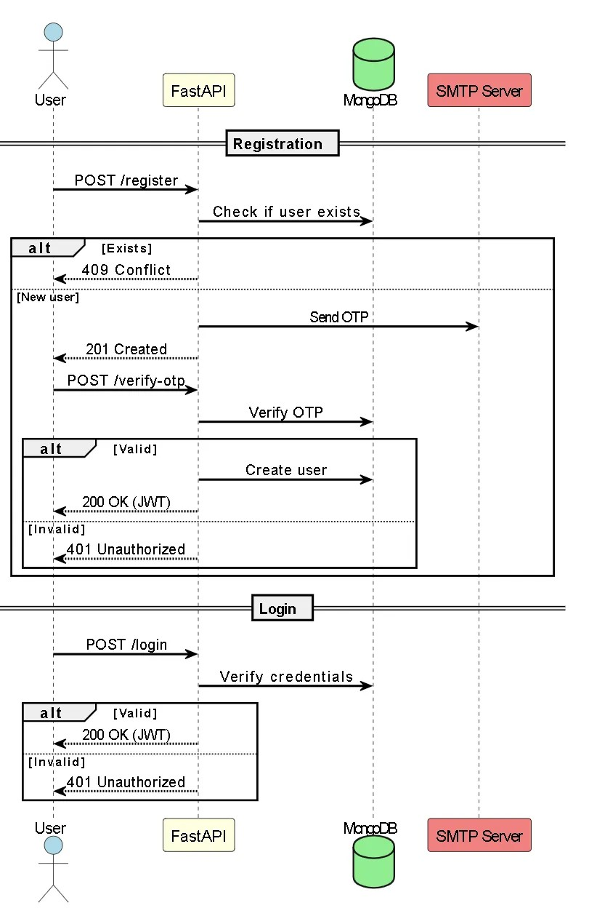
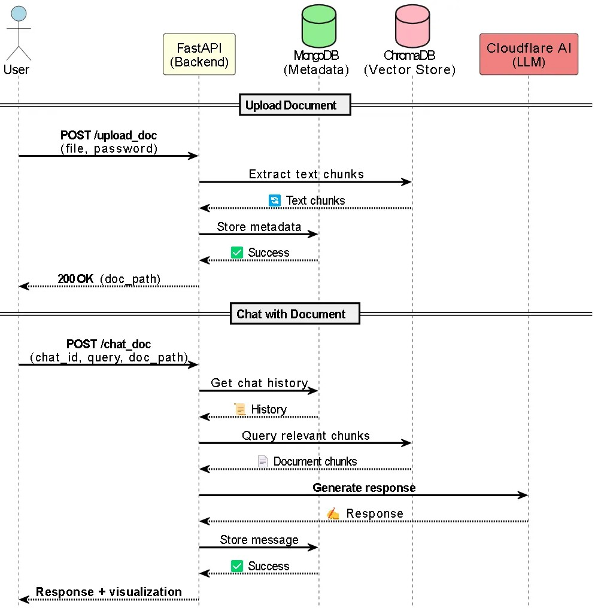
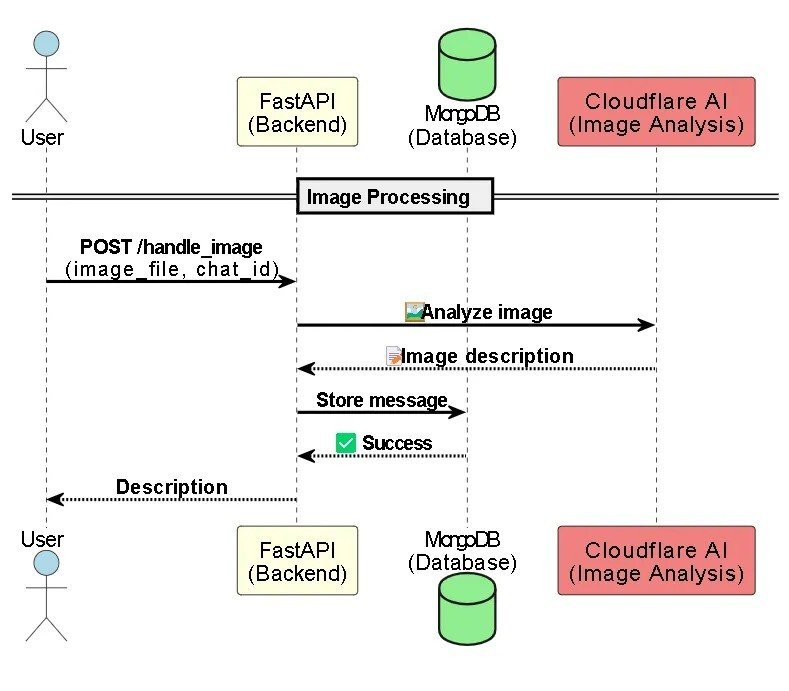
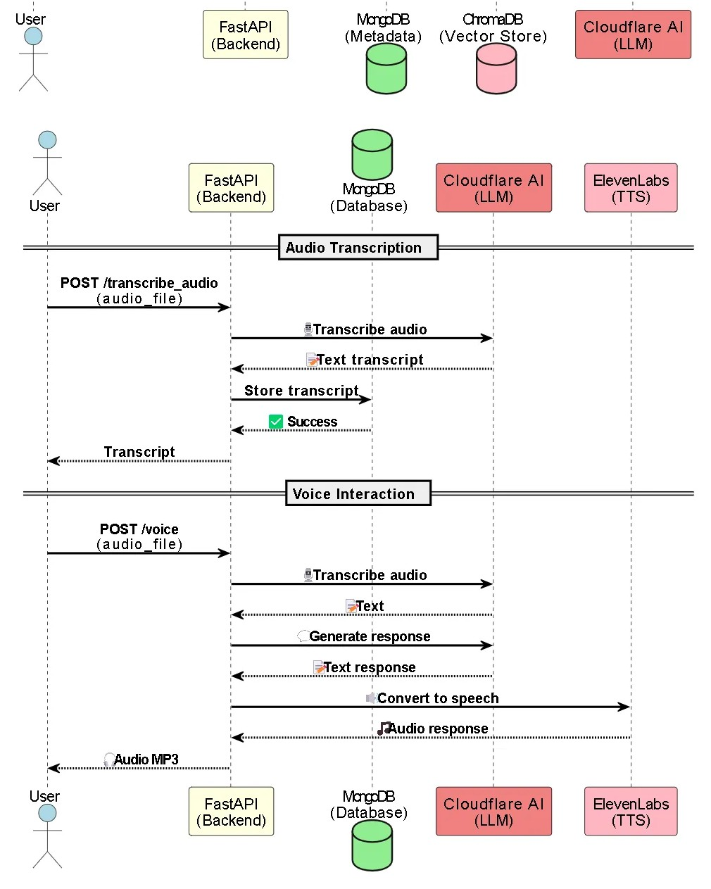
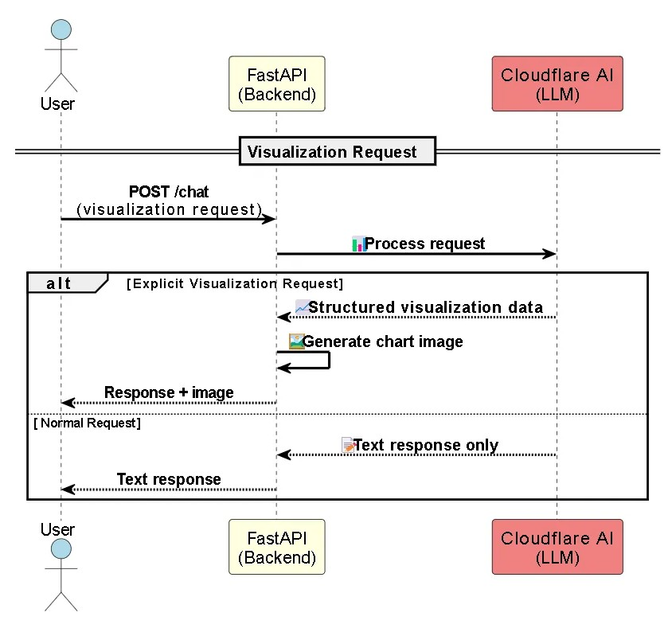
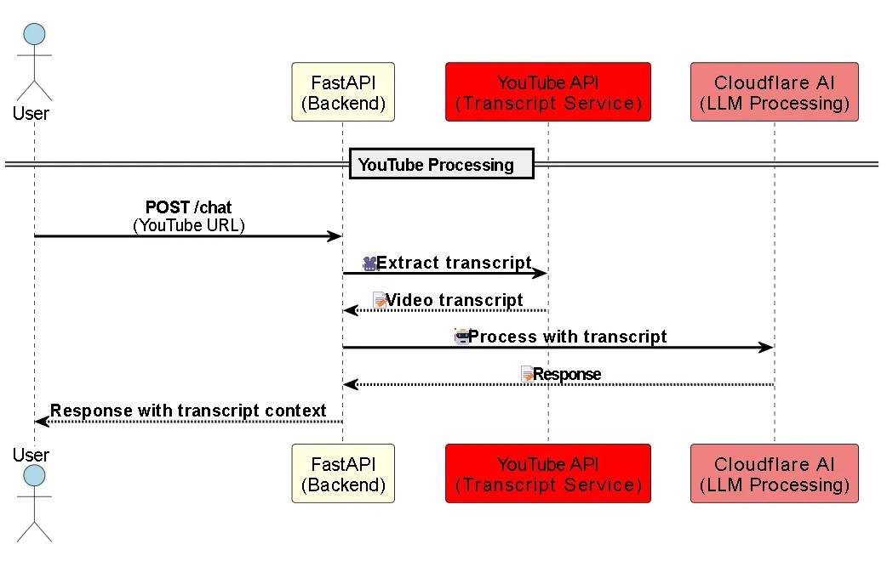

# MultiGPT - AI Agent with Multi-Modal Capabilities 🚀


An advanced AI agent capable of processing **text, audio, images, and documents** with visualization support. Built with FastAPI, Cloudflare AI, ElevenLabs, and LangChain.

## 🌟 Features

### 1. **Core Capabilities**
- **Conversational AI** with persistent chat history
- **Multi-language support** (English, Hindi, Marathi)
- **JWT Authentication** + Self-Hosted OTP verification
- **Document, Image and Audio Processing**
- **Rate-limited API endpoints**

### 2. **Input Processing**
| Type       | Endpoint          | Technologies Used              |
|------------|-------------------|--------------------------------|
| Text       | `/chat`           | Cloudflare LLM                 |
| Voice      | `/voice`          | ElevenLabs TTS + Whisper       |
| Audio      | `/audio`          | Whisper transcription          |
| Images     | `/handle_image`   | CLIP image analysis            |
| Documents  | `/upload_doc`     | PyPDFium2, docx2txt, msoffcrypto |

### 3. **Advanced Functions**
- **YouTube transcript extraction**
- **Data visualization** (bar/line/pie charts)
- **Auto-expiring file storage** (2-day TTL)

## 🛠️ Tech Stack
- **Backend**: FastAPI
- **AI Services**: 
  - Cloudflare (LLaMA-2, Whisper, CLIP)
  - ElevenLabs (Text-to-Speech)
- **Database**: MongoDB
- **Data Processing**: 
  - LangChain (Document chunking)
  - Pandas/Plotly (Visualizations)

## 🚀 Quick Start

### Prerequisites
- Python 3.9+
- MongoDB
- Cloudflare & ElevenLabs accounts

### 1. Clone & Setup
```bash
git clone https://github.com/yourusername/multigpt.git
cd multigpt
python -m venv venv
source venv/bin/activate  # Linux/Mac
# venv\Scripts\activate   # Windows
pip install -r requirements.txt
```
Also add frontend URL in the CORS

### 2. Running
```bash
uvicorn main:app --host 0.0.0.0 --port 8000 --reload

Access docs: http://localhost:8000/docs
```

### 3. Create .env file:

```bash
MONGO_DB_CONNECT= "mongodb://localhost:27017"
CLOUDFLARE_ACCOUNT_ID= "your_account_id"
CLOUDFLARE_AUTH_TOKEN= "your_api_token"
ELEVENLABS_API_KEY= "your_elevenlabs_key"
ELEVEN_VOICE_ID= "Voice_ID"
JWT_SECRET= "your_jwt_secret"
SMTP_SERVER= "smtp.gmail.com"
SMTP_PORT= 587
EMAIL_ADDRESS= "your@email.com"
EMAIL_PASSWORD= "your_password" #App Password
```

### 4. Working

<table>
  <tr>
    <td align="center">
      <b>Login and Signup</b><br>
      
    </td>
    <td align="center">
      <b>Chat with Documents</b><br>
      
    </td>
    <td align="center">
      <b>AI Image Processing</b><br>
      
    </td>
  </tr>
  <tr>
    <td align="center">
      <b>Speech Interaction</b><br>
      
    </td>
    <td align="center">
      <b>Data Visualization</b><br>
      
    </td>
    <td align="center">
      <b>YouTube Integration</b><br>
      
    </td>
  </tr>
</table>
